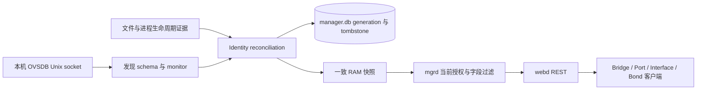

# 真实 OVSDB Discovery 与只读库存 v0.1

日期：2026-09-15。任务 [#36](https://github.com/sampsonlor/ovs-webui/issues/36)，[PR #62](https://github.com/sampsonlor/ovs-webui/pull/62)。前置 #35 / PR #61 已接受合并至 `ce7923ee85a50e1588af91d3510507caddb8136c`，标签 `phase1-secretstore-tls-v0.1`。

## 范围与数据流

mgrd 发现本机 `Open_vSwitch` schema，维护一个有界 monitor 快照，通过同一资源服务提供 Bridge、Port、Interface 和 Bond。配置写入 readiness 继续为 false；本批没有 OVSDB transact、任意命令、直接保存或隐式初始化 OVSDB。#21/#22 的完整页面和 #54 Svelte 页面迁移保留独立验收。



Go 依赖锁定批准的 `github.com/ovn-kubernetes/libovsdb v0.8.1`，校验和写入 go.sum。Adapter 使用其 schema/type/reference codec。读取传输封装仅允许 `get_schema`、`monitor`、`echo`，而非暴露库的写 client：在解码前限制 frame 分配，且以 `json.Number` 保持有符号 64 位整数；该版本库的通用 Row 解码先经过 float64，不能直接用来传输 next_cfg/cur_cfg。库类型不越过 `internal/provider/ovsdb`。

## Discovery 与一致性

按实际 schema 发现所有 tables、columns、native type/cardinality/constraints、mutable、ephemeral、references（strong/weak 与 key/value 位置）及 indexes；版本仅为来源信息。必需关系列缺失返回 `OVSDB_CORE_SCHEMA_UNSUPPORTED`。可选 VLAN 列缺失时 native VLAN 为 null/unknown；type/datapath_type 未观察到时保持 unknown，只有实际观察到空字符串才显示 default，无法判断的 internal/local_port 为 null。未知观察值保留，不推断支持的写操作。

一次 monitor 同时包含 Open_vSwitch、Bridge、Port、Interface。采用 RFC 7047 原始 monitor/update 的全值替换语义，初始化与增量严格区分 insert/modify/delete，并核对更新的 old 值与缓存一致；整条事务更新后再验证引用并发布，禁止逐行呈现中间悬空关系。重连重新取 schema 与完整 monitor，旧流不补接到新流。重复/未知 UUID、前值不一致、孤儿、多父关系、超过预算或协议错误触发重新同步；绝不返回被截断却声称完整的图。

仅采集明确的列集合；schema 接口标出 `monitored`。当前 counters、Linux carrier、硬件 provider、OpenFlow 规则不在此覆盖范围。Port 链路聚合状态和 Linux carrier 保持 Unknown/Unavailable，不能用一个成员 Interface 的 link_state 代替。

Interface options 仅保留 peer、remote_ip、local_ip、dst_port、key 五个非凭据语义键；其余键不进入缓存、revision、API、日志或普通导出。Interface.error 非空时仅保留 provider-reported-error 标记，不转发可能含敏感内容的自由文本。本批不采集 external_ids/other_config 等开放元数据。所有实际观察字段携带 provider/authority/observed_at/freshness/confidence，schema mutable 不等于用户可写权限，配置 ownership 未经额外证据保持 unknown。Controller 引用不赋予其所有 OVSDB 列的所有权。

## 身份与 generation

management_id 由 mgrd 生成 UUIDv4；绑定 `(generation, table, ovs_uuid)`。名称只用于展示/搜索，删除后持久 tombstone，同名重建分配新 ID。Bond 是 Port 的视图，复用 Port ID 和 member Interface 引用。local Port 要求 Bridge/Port/Interface 名称关系以及实际 internal type，不创建缺失的 local 对象。

generation 是持久随机 UUIDv4，不能由版本、PID、system-id、server_id 或 row _version 单独产生。核对证据包括：配置 endpoint/database、schema digest、Open_vSwitch root UUID、已观察 row anchors、monitor 连续性、本机 boot ID、endpoint peer PID/start time、文件 dev/inode，以及已观察文件尾段的后续一致性。

文件 witness 每次最多读 4 KiB：保存此前 offset/length/hash，再确认这些字节仍存在且相同。它可识别原 inode 上的回退；inode 改变也不能仅凭 root UUID 相同就延续。确认 OVSDB peer UID，并尽量匹配 server 的 open file；systemd 没有 CAP_SYS_PTRACE 时通过 endpoint 进程 argv 的规范数据库路径补充绑定证据，不增加进程权限，也不记录 argv 内容。API 的 file_binding_method 区分 observed-file-handle 与 configured-process-argument，后者不宣称已观察到打开的文件句柄。

| 证据 | 结果 |
| --- | --- |
| root/anchors、schema、文件 journal 延续，间隔不超过 30 秒 | 延续 generation；PID 改变记录 process-restarted-database-continued |
| 同一数据库中删除/重建某一普通对象 | generation 延续，旧管理 ID tombstone，新 row 得到新 ID |
| root 改变且原 anchors 全部断裂 | 新 generation，旧对象身份作废 |
| 同 root 的复制/替换、journal 回退、schema 改变、root/anchor 冲突 | reconciliation-required，阻止对象自动重新关联 |
| 跨 host boot、时钟回退、超过 30 秒间隔、文件证据不足 | reconciliation-required |
| 显式恢复 manager.db | 撤销认证上下文，同时强制重新核对 generation |

不充分状态持久锁定，恢复连接或等待更久不会自动解除。status/schema 仍可读；带旧身份的对象读取返回结构化 503。人工接受必须对当前精确摘要核对，产生新 generation，重分配本批对象 ID，记录 decision 与 Audit/Event；只改变管理元数据，不下发配置、不复活旧 Candidate/rollback。

这不是针对恶意 root 的防篡改证明：有权同时改写两个数据库及全部证据的管理员超出信任边界。普通文件压缩/替换也可能进入人工核对，宁可保留不确定性。完整备份验证、生命周期编排、旧事务处理和跨发行版资格分别由 #48/#49/#39/#51 完成。

## API 与权限

公共契约扩展为 v1.3.0，117 路径、134 操作，保留冻结 v1.0.0；IPC 1.3 增加 `inventory.read`，URI 仍由 mgrd 的编译操作表解析，不能转发任意 provider 查询。

| 入口 | 内容 |
| --- | --- |
| `GET /api/v1/inventory` | 当前可用性、generation/reconciliation、核对摘要、覆盖范围、schema digest、精确十进制 next_cfg/cur_cfg |
| `GET /api/v1/inventory/schema` | 分页 schema tables/columns/types/mutable/references/indexes；filter 按表名包含匹配 |
| `GET /api/v1/{bridges,ports,interfaces,bonds}` | 同一快照及共享身份；Bond 复用 Port binding |
| 对应 `/{resource_id}` | 当前强身份详情；旧删除 ID 返回 404 |

每次读取重新计算 grant/Token 的当前权限。除既有 state.read 外，库存需 inventory.read；配置值另需 configuration.read，缺少时保留字段并标记 withheld/native null。schema 与 status 的入口需 inventory.read。Standard/Expert 不改变这些条件；当前 allowed_operations/allowed_actions 都为空。

分页 cursor 使用进程内随机密钥加密认证，绑定主体、权限 revision、operation、filter、limit、generation、snapshot、最后一个 ID 与 30 秒期限。数据变化或 mgrd 重启使旧 cursor 返回 410；同数据 heartbeat 保持 snapshot_id，普通分页不因采样时间变化而失效。没有不受限的历史快照缓存。未知/首次失联返回 503，不伪造空库存；实际空数据库返回完整空列表。断联保留最后已知 RAM 数据并标记 stale/degraded，重启后从 Unknown 开始，不持久化 link/counters。

## 运行与恢复

默认只读 endpoint 为 `/run/openvswitch/db.sock`，规范数据库文件为 `/var/lib/openvswitch/conf.db`，OVSDB peer UID 默认为 0。可用 `--ovsdb-socket`、`--ovsdb-file`、`--ovsdb-peer-uid` 覆盖，systemd 配置使用 ExecStart drop-in；文件参数须为规范路径，不能指向 symlink。OVS 未安装或暂未启动时认证服务继续运行，库存明确 Unavailable。两个 WebUI units 不对 OVS 使用 stop propagation。

本机管理员核对 root/文件/恢复来源后，从 `/api/v1/inventory` 读取 `reviewed_evidence_digest`。停止 mgrd 后执行（占位值应替换为刚核对的实际参数）：

```sh
ovs-mgrd --database /var/lib/ovs-webui/manager/manager.db \
  --ovsdb-socket /run/openvswitch/db.sock \
  --ovsdb-file /var/lib/openvswitch/conf.db \
  --reconcile-ovsdb REVIEWED_SHA256 \
  --reconciliation-reason 'Reviewed database restore and current object bindings'
```

只接受同一份最新证据，过期/不同摘要拒绝；服务互斥锁保证不能旁路运行中的 mgrd。完成后启动 mgrd，再取新的对象和 generation。此命令不初始化 OVSDB，不恢复网络配置。认证恢复仍使用已接受的 `--prepare-restore-security`，现同时标记库存待核对。

## 预算与验收

| 边界 | 上限/行为 |
| --- | --- |
| JSON-RPC frame / JSON | 4 MiB、32 层、300,000 tokens、每数组 4096 元素；拒绝重复 key/非法 UTF-8 |
| schema | 512 KiB、128 tables、每表 256 columns |
| 当前 graph | 2048 rows、4 MiB，单 row 16 KiB；Bridge 500 Ports、Port 128 Interfaces |
| 探测与恢复 | echo 每 2 秒；freshness 6 秒；连接 timeout 2 秒、RPC 5 秒、重试 250 ms 至 5 秒 |
| HTTP/IPC | 分页内容约 40 KiB，最终响应 48 KiB；不扩大已有 64 KiB IPC 上限 |
| 持久身份/证据 | 16,384 identities、4096 generations；tombstone 不回收；最近 256 次详细核对，Audit 使用现有容量边界 |

真实 Linux CI 使用隔离 OVSDB/ovs-vswitchd dummy datapath、两个 systemd daemon、真实 Unix UID 与 HTTPS 登录，依次加载三份固定上游 schema，测试空/失联/重连/外部修改/删除重建/复制恢复/新建/manager restore 与权限。证据分别记录实际 **binary version** 和 **schema fixture version**；本批 schema 矩阵不是宣称三种 OVS binary 或全发行版通过 #51 资格。

原型页面、模式及响应式职责保持已接受范围。本批新增的 API 异常/权限/恢复语义由测试与文档验收，完整页面交互按 #21/#22/#54 单独评审。

协议依据：[RFC 7047](https://www.rfc-editor.org/rfc/rfc7047.html)、[OVSDB server 协议说明](https://docs.openvswitch.org/en/stable/ref/ovsdb-server.7/)、[OVS 原生 schema](https://github.com/openvswitch/ovs/blob/v3.3.9/vswitchd/vswitch.ovsschema)。schema 来源及校验和见 [testdata 说明](../../internal/provider/ovsdb/testdata/README.md)。
