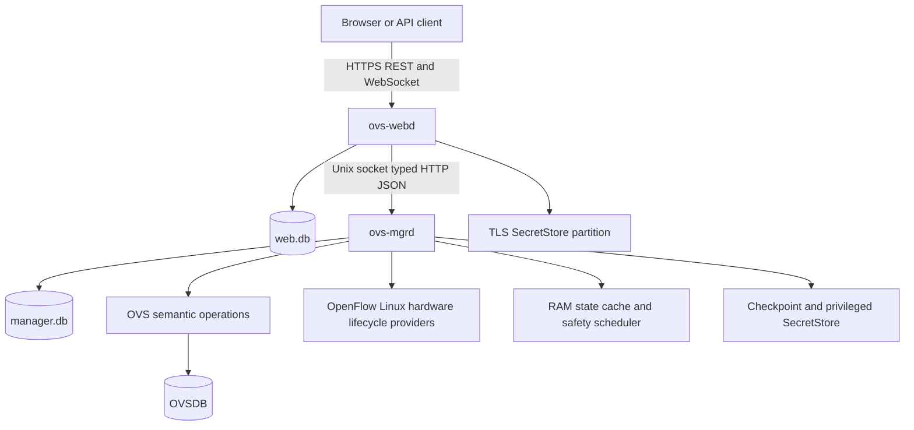
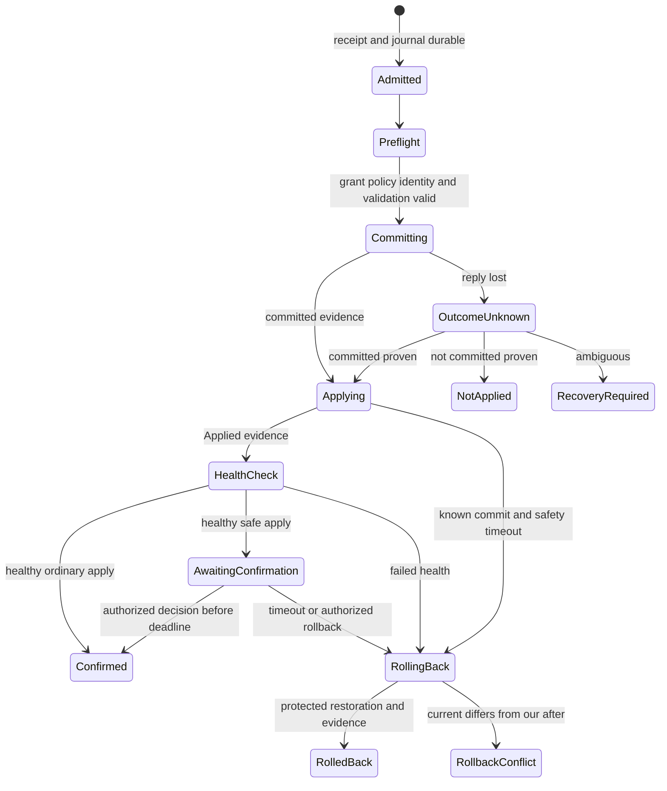

# Phase 1 正式管理面实现设计

日期：2026-09-09。状态：**Proposed for Review**。对应 [#30](https://github.com/sampsonlor/ovs-webui/issues/30)，属于 [Phase 1](https://github.com/sampsonlor/ovs-webui/milestone/1)。本文确定可供审阅的实现选择；批准后才作为 #31 起后续工程的输入。

首条正式切片是登录 → 真实 Port 库存 → VLAN Candidate → Diff/Validation → 字段级执行 → Applied → Safe Apply → Event/Audit。首切片的完成不代表 Phase 1 GA。完整范围见[范围与页面映射](PHASE1_SCOPE_TRACEABILITY_v0.1.md)，API 迁移见[契约设计](../contracts/PHASE1_API_MIGRATION_v0.1.md)。

## 依据与准入

Architecture v1.0.1 与 IA v1.0 是批准基线。2026-09-09 收到的 [Scope v1.0](../baselines/OVS_WebUI_Phase1_Scope_v1.0.docx)正文仍为 Draft for Review；已原样归档，不能因文件已收到便改称 Approved。Scope 的 Required/Manage、58 个 Scope ID、交付物和退出条件全部纳入映射，歧义由 Architecture 的硬边界优先。

P0、P1 六批及整合已接受；main 基于 PR #18 / `176bca1`。[共享库存 PR #19](https://github.com/sampsonlor/ovs-webui/pull/19)仍待接受，其 4/10/13 合成关系与 URL 只作为待审原型证据。设计可以先形成可审阅稿；后续正式实现以[审阅记录](../reviews/PHASE1_DESIGN_v0.1.md)的准入为准。功能主单中的真实服务验收不会被设成后端开工之前必须关闭的循环依赖。

## 进程与代码组织



保持两个 daemon。安全调度器是 mgrd 内独立于 HTTP/诊断请求的常驻任务，不引入第三个 watchdog daemon。systemd 监督两个服务，但二者均不得对 OVS units 使用 `PartOf`、`BindsTo` 或 stop propagation。停止、升级或卸载 WebUI 不操作 OVS。

后续 #31 建立以下目录；本 PR 不生成运行时占位实现，也不改变现有原型构建。

```text
cmd/ovs-webd/                    HTTPS, embedded assets, composition root
cmd/ovs-mgrd/                    privileged composition root
internal/domain/                identity, typed operations, policy, state machines
internal/web/                   REST, session mapping, workspace service
internal/manager/               auth, admission, execution, recovery, audit
internal/ipc/                   explicit operation registry and codecs
internal/repository/{web,manager}/
internal/provider/{ovsdb,openflow,linux,hardware,lifecycle}/
internal/state/                 bounded current observations, events, health
internal/secret/                partitioned envelopes and redaction
internal/migrations/{web,manager}/
api/v1/                        published OpenAPI, examples, compatibility baselines
frontend/                      Svelte 5, TypeScript, Vite, en and zh-CN strings
packaging/{systemd,deb,rpm}/
```

Provider/library 类型不得出现在 Domain 或公共 API。原型 React/Vinext、`contracts/core-v0.1.mjs` 和 Node SQLite lab 留在现有位置，按参考工具维护；正式二进制嵌入 Svelte 静态资源，生产无 Node/Python 依赖。

## 实现选择与版本窗口

选择及替代方案记录在 [ADR 0001](../adr/0001-phase1-runtime-contracts.md)。下列是本稿的目标窗口，**尚未宣称通过平台资格测试**。

| 项目 | 本稿选择 | 接受证据 |
| --- | --- | --- |
| Go | 工具链 1.27.1，语言版本 1.27，CGO-free 发布；安全补丁更新后重新构建 | #31 amd64 和原生 arm64 Build/Test |
| SQLite | `modernc.org/sqlite v1.58.0`，`database/sql`，驱动仅在 Repository Adapter 内使用 | #32 双架构、WAL、busy/corruption、迁移和备份测试 |
| Migration | 自有顺序编号 SQL，`go:embed`，每库 `schema_migrations(version, checksum)`；不引入 ORM 或跨库协调器 | 修改已执行 migration 校验失败；仅 forward migration，恢复使用整套匹配备份 |
| IPC | Unix stream socket 上 HTTP/1.1 + UTF-8 JSON；协议 1.0；显式 operation registry | #31 framing/size/auth/version/fuzz 测试 |
| 公共契约 | OpenAPI 3.1.1，`/api/v1`，snake_case；发布后同 major additive-only | #33 未知响应值、兼容 diff 和 UI/API 一致性 |
| OVS | 兼容下限目标 3.3.9；必测 3.3.9、3.7.1、4.0.0 的实际 schema；每个 minor 用已核验安全补丁 | #36/#39/#51 真实 userspace 与 kernel/VM 矩阵；版本只决定测试窗口，功能由 discovery 决定 |
| 平台 | Ubuntu 24.04、Debian 13、Rocky/Alma 9 的 userspace；Linux amd64/arm64；systemd/kernel 流程另做 VM 验收 | #50/#51；其它发行版 best-effort，不假定安装或新增软件仓库 |

版本取证日期为 2026-09-09：[Go release history](https://go.dev/doc/devel/release)、[SQLite driver v1.58.0](https://pkg.go.dev/modernc.org/sqlite@v1.58.0)、[OVS downloads](https://www.openvswitch.org/download/)。OVS 版本升级不自动打开新的写能力；libovsdb 继续采用批准的 [ovn-kubernetes/libovsdb](https://github.com/ovn-kubernetes/libovsdb)，具体依赖校验和在引入模块的 PR 中锁定。

## 私有 IPC

主 socket `/run/ovs-webui/mgrd.sock`，目录 root 拥有，socket `root:ovs-webui-web`、0660。mgrd 校验 `SO_PEERCRED` 的固定 webd UID；组权限与 socket 权限不是最终授权。仅绑定 Unix socket，无 TCP listener。内部 scheduler 通过进程内接口调用，不伪装浏览器 grant。

连接先 `POST /ipc/v1/handshake`：`protocol_major=1`、`protocol_minor=0`、`software_version`、`schema_digest`。初版两个进程要求相同发布版本和 IPC schema digest；不匹配仅允许握手/健康查询，公开 API 报 `IPC_VERSION_MISMATCH`。包升级按停止 webd → 停止 mgrd → 原子替换匹配二进制 → 启动 mgrd 恢复 → 启动 webd 的顺序，OVS 持续运行。

每个 operation 是固定 `POST /ipc/v1/operations/{registered-name}` 与具体 Go request/response struct；不接受命令名、shell、任意 SQL、OVSDB operations 数组或未知 operation。示例 registry：

| Operation | 输入要点 | mgrd 授权及结果 |
| --- | --- | --- |
| `auth.authenticate` | provider、用户名、write-only password | Local/TACACS+ 验证，返回仅供 webd 保存的 opaque grant |
| `auth.inspect` / `auth.revoke` | grant；撤销目标有强 identity | 当前主体、effective capabilities 或撤销结果；不接受客户端角色 |
| `inventory.read` | 对象 ID、generation、cursor | 逐字段权限过滤、来源与覆盖范围 |
| `candidate.validate` | immutable candidate envelope、revision、typed intents、reviewed bindings | 再取真实基线，执行 Domain Validation，持久 Validation/Job |
| `transaction.submit` | validation ID、candidate revision、reason、mode、request identity | 验证 grant、策略、身份、字段、风险并持久入场 |
| `transaction.decide` | transaction ID、expected sequence、confirm/rollback | 校验 deadline、当前 capability、状态及对象关联 |
| `transaction.reconcile` | 原 transaction ID | 只核对结果；不接受客户端指定的 applied/not-applied |
| `resource.read` | 白名单 resource kind、ID、cursor | 重新授权 REST 所需 Job/Event/Audit/receipt |

opaque grant 放 IPC `Authorization: Bearer ...`，不进入普通日志/请求 hash/错误 details；correlation 使用独立非秘密 ID。JSON 拒绝重复 key、未知请求字段、额外顶层 value、非法 UTF-8、超深对象和超限数组；响应允许未来新增字段，未知状态显示 Unknown。HTTP body 上限 1 MiB，header 上限 16 KiB；读 header 2 秒、请求 body 5 秒、普通同步处理 5 秒。长操作先落账再返回 accepted resource，耗时任务不占用 HTTP handler。

webd 与 mgrd 都使用固定分类队列：auth、配置/恢复、普通读取、重诊断。每类有独立配额；公开 request 不能自报 priority。采集/诊断拥塞不能耗尽安全调度器、DB 写入通道或 grant 校验预算。

## 双库和持久化职责

| 存储 | 所有者与内容 | 一致性及故障处理 |
| --- | --- | --- |
| `/var/lib/ovs-webui/web/web.db` | webd；preferences、labels、profiles、overrides、candidate、session→grant 映射、workspace receipt、提交 handoff/outbox | 不保存 password verifier/roles/token scope 权威。web.db 损坏不能重建管理员；读写草稿停止，mgrd 保持已有恢复任务 |
| `/var/lib/ovs-webui/manager/manager.db` | mgrd；principals、roles/capabilities、token hashes、grants、identity/generation、policy revision、validation、request receipt、transaction journal、locks、jobs、events、audit | 目录 0700 root；不得给 webd 读写权限。丢失/损坏时保留文件，fail-safe read-only；不以新空库继续执行 |
| RAM State Cache | mgrd 收集；webd 仅保留受权限过滤的传输缓存 | 当前 counters/link/health 不持久化；重启后 Unknown → resync |
| Checkpoint | mgrd；一个 LKG、manifest、checksum | 临时文件写入并 fsync，原子 rename 后同步目录；失败不替换旧 LKG |
| SecretStore | webd TLS、webd session 与 privileged consumer 分区 | 各自独立密钥和目录 ACL；备份包含 ciphertext，默认不含 master key |

两库各用 WAL、`synchronous=FULL`、`foreign_keys=ON`、`busy_timeout=2000ms`；每库单 writer connection，最多 4 个有界 reader。写事务不得跨网络/provider 调用。读取超过 2 秒取消，避免长期持有 WAL snapshot；后台 checkpoint 失败进入组件告警，不删除 WAL 或复制裸 DB 文件。FULL 的耐久性依据见 [SQLite WAL](https://www.sqlite.org/wal.html)。

每库 migration 在服务 readiness 前执行，备份/恢复带版本和 checksum。manager.db 的 transaction admission 必须在一次 SQL transaction 中写 request receipt、immutable ChangeSet、execution journal、重叠资源保护和 Audit admission，commit 成功后才发 OVSDB transact。SQLITE_BUSY/IOERR/FULL 在入场前返回 not-started；发送 OVSDB 后的持久化失败必须按 unknown/recovery-required 处理。

跨库无 2PC：webd 先持久保存 Candidate revision 与 handoff，mgrd 接受完整不可变副本并最终校验。webd 应答丢失时按原 request 查询 mgrd；仅在取得关联 receipt 后补齐 outbox。终态成功后，只删除仍匹配已消费 revision/intent ID 的草稿；用户已追加的变更继续保留。web.db 被篡改最多改变非权威意图；不能使 mgrd 跳过重新授权、真实基线校验或触发自动 Apply。

## 对象身份与版本

| 字段 | 精确定义 |
| --- | --- |
| `management_id` | 管理实例内 UUIDv4；mgrd identity registry 分配；URL/历史使用它，不能用名称代替 |
| `ovs_uuid` | 当前 table row UUID；与 table、generation 一起构成强绑定；删除后 tombstone，重建同名 row 不继承旧 ID |
| `instance_generation` | mgrd 持久随机 UUIDv4，表示经证据确认的 OVSDB 生命周期；不递增，不由 `_version`、server_id、system-id 单独计算 |
| `config_revision` | 当前受管理配置快照的 opaque equality token；普通字段变化更新 revision，通常不改变 generation；不是全节点 CAS gate |
| Candidate `revision` | web.db 中该用户草稿表示的 opaque token，strong ETag；不包含每次变化的 server time |
| Transaction `sequence` | manager.db 每次状态变更单调递增，以十进制字符串传输；只在同一 transaction 内比较 |
| `next_cfg` / `cur_cfg` | OVS 原生有符号 64-bit 计数，以十进制字符串传输；只作此 generation 内特定目标的 Applied progress |
| `policy_revision` | mgrd 安全/风险策略版本；改变使对应 Validation 失效，操作执行前重新校验 |

Generation reconciliation 存储数据库 endpoint/name、schema digest、Open_vSwitch root row UUID、已见 table/row UUID anchors、连续 monitor/reconnect 证据，以及本机可用的数据库路径/文件生命周期证据。路径、inode（压缩可变化）、schema 版本、进程重启、单一 semantic ID 都不是充分身份证明。root/anchor 连续且没有相反证据可延续；确认新建数据库/强身份断裂则创建新 generation；不充分或互相矛盾时为 `reconciliation-required`，阻止旧 Candidate/Profile/transaction 执行。

恢复管理备份、OVS 长期断联后或发现疑似数据库替换时，必须重新核对；相同 root UUID 的复制备份不能仅凭 UUID 就视为连续。无法证明生命周期连续时需要显式人工 reconciliation 和 Audit。首轮 discovery 保持只读，不向 OVSDB 自动插入身份标记。mapping 决定只重关联 metadata，不自动下发配置，也不能复活旧 Safe Apply rollback。

## 字段 Authority 和原生 VLAN

配置值由 OVSDB 对应列提供；OVS Interface.link_state、Linux carrier、NIC speed 是不同字段，各有 provider、observed_at、freshness、confidence、availability。Controller 对 OpenFlow 的 authority 不等于对所有 OVSDB 列的所有权。字段权限和 controller-owned/unknown 策略均由 mgrd 计算，Standard/Expert 不参与授权。

VLAN intent 用 `port.vlan.set`，明确对象 binding 和 `vlan_mode/tag/trunks/cvlans`；mgrd 构造 typed ChangeSet 的 before/after，不能接收任意 row rewrite。Standard 支持 access、trunk、native-tagged、native-untagged；Advanced 的 dot1q-tunnel/QinQ 由 schema 与 validator 门禁控制。空 trunks 保留原生 all-VLAN 语义，并在 Diff 中明确扩大范围；原生缺省 mode 与不认识的值保留读回，不能静默归一化。普通可编辑 VLAN 范围为 1–4094；观察值保留 schema 允许的 0/4095，未经单独语义证明不提供相应写入。

VLAN 的相互约束列作为一个语义组验证；其它未触及列/map keys 原样保留。每个 Domain Operation 计算读集、写集、引用依赖及约束；Bridge/Port/Interface 创建删除要使用一条合法 OVSDB 原生事务维持强引用、local internal interface 与 GC 语义。[OVS schema 手册](https://www.openvswitch.org/support/dist-docs/ovs-vswitchd.conf.db.5.html)

## 并发执行与 Safe Apply

采用 [OVSDB wait](https://www.rfc-editor.org/rfc/rfc7047.html#section-5.2.6) 的 `timeout=0`，对已解析强身份及必要的 touched-field/constraint read set 做原子比较后 update/mutate；不使用 row `_version` 或整个节点 revision 作为所有操作的冲突条件。两个无依赖的不同字段变更可以并发成功，同字段冲突返回三方 Diff。lab 的节点级 `TRANSACTION_ACTIVE` gate 不作为正式锁模型。

mgrd 的持久 operation protection 按重叠字段、结构引用依赖及管理路径恢复域分配；已有 Safe Apply 的写集/恢复依赖在终态前受保护。保护只协调本管理面的任务，不能代替 OVSDB CAS，也不阻塞无关字段。OVS 生命周期、同一管理路径迁移等真实共享依赖允许互斥，并明确冲突资源；禁止把所有配置统一扩大为全局锁。



OVSDB transact 将最小配置变更和 `next_cfg` increment 放在同一原子事务；读取 increment 后的确切目标值。该计数是进度同步点，不能导致用户配置字段发生虚假冲突。监控同一 generation 内 `cur_cfg` 达到该目标，并核对本事务 identity/目标配置；计数追上不能单独证明对象创建无错误、管理可达或业务正常。reset/wrap、实例变化或 provider 不能给出可靠进度时进入明确的 evidence 缺口；只有已验收的等价 provider evidence 才可替代。

`knowledge`、OVSDB `commit_outcome`、`applied_outcome`、Safe Apply 状态、Health 和用户确认分别保存。回执丢失后 resync，以持久 receipt、写集、强 identity、before/after、进度及因果证据判断；值刚好等于 after 不足以证明是本事务提交。无法证明就保持 Recovery Required，不自动再次发送 OVSDB transact。

两个时间预算独立：入场后有 preflight/Applied 总保护预算；**用户确认窗仅在 Applied 且 Health/Reachability 成立后启动**。达到 Applied 预算但 commit 已知时，可按受保护 after-image 尝试恢复；commit 仍未知时先 reconcile，禁止用超时伪造 Not Applied。

回滚先在同一事务 `wait current == our_after` 再恢复 before；结构删除/新建引用也有精确依赖和补偿计划。任一前提失败产生 Rollback Conflict，保留 journal 和阻塞范围，不覆盖外部修改。generation 改变时旧补偿永不执行。rollback 本身也需要 commit/Applied/health 证据，不能把发送了补偿当作 RolledBack。

mgrd 的 journal 保存 boot ID、monotonic 截止点、wall-clock 辅助时间、sequence 和 protection。相同 boot 重启可恢复 deadline；跨 boot 不能重建或延长旧确认窗，应先 reconcile 并进入恢复/受保护回滚。系统时钟倒退、截止证据缺失或 manager.db 异常均不得恢复确认权限。确认、超时、权限撤销和手动回滚通过同一 journal CAS 裁决。

## 授权与 SecretStore

Local 使用 Argon2id：初始参数 memory 64 MiB、iterations 3、parallelism 1、随机 salt 16 bytes、hash 32 bytes；#34 在最低测试硬件校准延迟与并发预算，调整参数需保留 hash version 和重哈希迁移。TACACS+ 是 Phase 1 必交 provider，不能只留下接口占位；timeout/unavailable 与明确认证拒绝分开，不因 Reject 自动降级为匿名或另一用户。保留测试、确认与最后可用本地 break-glass 登录路径。

mgrd grant 为 256-bit 随机 opaque secret，manager.db 仅保存 hash 与 principal、capability ceiling、epoch、issued/expiry、elevation 和撤销信息。webd 只保存 session 映射及运行所需 grant；mgrd 每次计算当前 effective capabilities 和对象/字段限制。token scope 不超过创建人的当前有效能力，之后权限收紧立即生效。不能通过修改 web.db、请求 actor/role 或 Expert Mode 获得额外权限。

入场检查和 provider dispatch 前都重验 grant/policy；撤销与 dispatch 通过 mgrd 同一裁决点排序。撤销先胜出时拒绝未发出的操作；已经发出的 OVSDB 请求不能被撤销追溯取消，仍须 reconcile 并保留证据。确认/手动回滚按当前权限裁决；已经授权并持久化的自动安全恢复继续运行。

浏览器 session cookie 值同样只以 hash 作查找。webd 为重启恢复保留的 grant 使用 session consumer key 加密，web.db 仅存 envelope/reference；不能把 grant plaintext 放入管理备份。恢复备份时旋转 auth/request epoch、撤销已恢复的 session/grant/token 使用上下文并要求明确重新认证/凭据恢复；备份中的旧权限不得自动成为当前授权。正常 daemon 重启不等于备份恢复，仍按原有持久到期和撤销状态处理。

| Capability namespace | 首批代码及职责 |
| --- | --- |
| Read | `inventory.read`、`state.read`、`capabilities.read`、`jobs.read`、`events.read`、`audit.read` |
| Workspace | `workspace.write`、`configuration.validate`；仅本人 Candidate，管理他人草稿需独立管理能力 |
| Configuration | `configuration.apply`、`configuration.confirm`、`configuration.rollback`；另按 `ovs.port.vlan.write` 等 Domain code 校验写集 |
| Diagnostics | `diagnostics.read`、`diagnostics.active`、`diagnostics.disruptive`、`support_bundle.create` |
| Security | `access.users.manage`、`access.roles.manage`、`access.aaa.manage`、`access.tokens.manage`、`access.tls.manage` |
| Recovery | `backup.create`、`backup.restore`、`configuration.import`、`management_network.write`、`ovs.lifecycle.manage` |
| Management plane | `management.policy.write`、`management.debug.write`、`management.services.control`；仅自身两个服务，活动安全事务期间拒绝人为重启 |
| Future conditional write | `openflow.local.write`；初始 registry 返回未实现/禁用，只在独立完整审阅后开放 |

Reader/Operator/NetworkAdmin/SecurityAdmin/Administrator 是上述 capability 的显式模板，不能在 code 中以 role 名跳过检查；默认用户无授权。Operator 可读与受控 active diagnostic；NetworkAdmin 可配置和恢复但无安全主体管理；SecurityAdmin 管理安全而不隐含交换写权限。Administrator 仍受最后管理员保护、provider maturity、risk 和 recovery gate。高风险提交及安全策略变更需要当前 grant 的短时 elevation；自动安全回滚由已持久授权的 journal 执行，不依赖原浏览器仍在线。

Session cookie `__Host-ovs_session`，Secure/HttpOnly/SameSite=Strict/Path=/，无 Domain；同源变更校验 Origin 和 session-bound `X-OVS-CSRF-Token`。新建登录同样校验 Origin，防 login CSRF。浏览器不接触 mgrd grant；API token 使用 Bearer，不作为浏览器 Session。默认 HTTPS，显式配置受信 reverse proxy 及其可写 headers。

可复用 secret 使用 AES-256-GCM、随机 96-bit nonce、AAD 绑定 partition/secret ID/key version/用途。TLS partition 仅 webd 读自身 key；TACACS 等 privileged partition 仅 mgrd。master key 是独立 root 管理文件，支持 key_version 的显式轮换。TLS 证书 candidate 验链、hostname、有效期及私钥匹配后原子激活；保留上一可用证书和有界恢复窗口。GET、日志、Audit/Event、普通 export 和 Support Bundle 永不返回 plaintext secret。

## 初始参数与资源预算

以下默认值在设计接受后进入 typed config schema；更改需测试证据。不得用调大预算掩盖无界队列。

| 参数 | 默认 / 上限 | 超限或失败行为 |
| --- | --- | --- |
| Candidate intents | 32 / 128；body 1 MiB | 保存前 413/422，原草稿不变 |
| Validation 有效期 | 300 秒 | revision/policy/identity 或依赖变更立即失效 |
| Preflight | 10 秒 | 未执行时 not-started；已入场 journal 保留 |
| Applied 等待 | 30 秒；lifecycle operation 单独定义 | 不启动用户确认窗；按已知/未知提交证据恢复 |
| Safe Apply confirmation | 120 秒，配置范围 30–600 秒 | 仅服务端决定；不可由客户端延长已有 deadline |
| Reachability probe | 每次 2 秒，最多 3 次，10 秒预算内 | 使用当前客户端路径/明确配置目标；无证据不开放高风险 Apply |
| Session | idle 15 分钟 / absolute 8 小时 | 每次操作校验；重启/撤销保持 expiry |
| Elevated grant | 5 分钟 | 仅在风险要求操作重新使用；不能延长普通 session |
| API token | 默认 30 天 / 最大 365 天 | expiry 和 revoke 即刻约束新操作 |
| Active diagnostic / packet capture | 默认 30 秒 / 最长 300 秒；普通输出 4 MiB、capture 64 MiB | cancellable Job；达到上限 truncation/终止，不静默丢失状态 |
| List cursor | 默认 100 / 最大 500；snapshot 30 秒 | 绑定 principal/filter/generation/snapshot；过期 410，不能跨快照拼页 |
| WS client | 256 条或 1 MiB queue；counter coalesce 1 秒 | gap/resync-required；断开慢客户端，不丢弃权威 Job/Audit |
| Shared observations | 64 MiB / 10,000 条热对象，按先到上限 | 大集合按需分页；eviction 显式降级，不把缓存当完整库存 |
| Concurrent heavy jobs | 2；等待队列 16 | 429 + retry hint；不占安全队列 |
| Safety admission | 32 个活动保护事务，独立 64-entry 控制队列 | 达上限拒绝新入场；不删除 unresolved journal |
| Event / Job / Audit retention | Event 30 天、终态 Job 30 天、Audit 180 天；记录数分别 100k/100k/500k | 终态记录按配置和可见截断边界回收；仍被活跃事务引用的证据保留；空间不足先拒绝重任务/新写 |
| Watchdog | safety tick 1 秒，systemd WatchdogSec 10 秒 | heartbeat 必须证明安全循环仍推进，不能由无关定时 goroutine 掩盖挂死 |

分页/搜索必须先授权再合成计数，不能通过 total、截断标志或 cursor 暴露无权资源。新的访问者共享 collector，不触发每客户端 polling。默认正常 link/counter 采样 5 秒、健康聚合 5 秒、低频硬件 60 秒；OVSDB/netlink 优先 monitor/event，断线后 stale 而不是延续 Fresh。

## 后续顺序与审阅

#31–#37 建基础；#38–#41 建真实 Ports/VLAN 安全闭环；#42–#47 扩展原生配置、观察和运维；#48–#51 完成恢复、管理路径、打包与 release。各模块从第一天执行 amd64/arm64 和相关安全测试，#51 汇总证据而不是最后才开始测试。

新增 Scope 明确的 QinQ、NetFlow、双语、全局搜索/一跳拓扑及 conditional OpenFlow 写入均在[映射与差异表](PHASE1_SCOPE_TRACEABILITY_v0.1.md)跟踪。#52 提供搜索/本地拓扑，#53 单独处理 OpenFlow conditional write，#54 完成首切片之外的 Svelte/双语页面，#55 交付可操作的管理员/API 文档。#51 在发布前汇总这些新增任务的证据；它们不依赖 #51 完成而造成循环。OpenFlow 当前已接受原型继续 Observe；是否开放 local-managed Expert 写入要有独立 ownership、并发、transaction/evidence 和恢复审阅。DPDK/Offload 仍 Observe。

本任务的冻结需接受 Scope 状态/差异处置、身份与权限、双库 handoff、typed IPC、事务/恢复、参数、版本窗口和 API 迁移。真实 OVS 与软件实现测试属于后续模块的验收；设计文档检查不能冒充那些证据。
